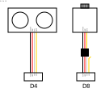

<div align="center">

# Arduino Uno Sonar 1.0
[](https://github.com/aronyx0/uno-sonar)

[](https://github.com/aronyx0/uno-sonar)
[](#Installation)


</div>

Uno Sonar is a set of programs that aims to measure and visualize distances like a radar system.

## Compatibility
This program was tested on Windows 11, and there are no guarantees it will work on MacOS or UNIX-based operating systems.
The Arduino type used in testing is an Arduino Uno R4-WiFi, included with the Arduino Sensor Kit. Using any other components than recommended in the [Components section](#Components), may result in the programs malfunctioning, or not working at all.

## Components
* [Arduino Sensor kit](https://sensorkit.arduino.cc/)
* [Grove Ultrasonic distance sensor](https://wiki.seeedstudio.com/Grove-Ultrasonic_Ranger/) (ref. "sonar")
* [180° Servo motor]() (ref. "servo")
* Compatible cables

## Installation
1. Download the whole GitHub Repo, and unzip the folder.
1. Ensure you have downloaded the [Arduino IDE](https://www.arduino.cc/en/software/) and [Python version 3.14.0](https://www.python.org/downloads/)
1. Copy all zip folders in `./lib/` to your Arduino library folder. This is usually located in `~/Documents/Arduino/libraries` for Windows. Do not unzip the files.
1. Install all Python requirements by entering the following command in your terminal (opened in the repository folder `./`):
    ```powershell
    cd gui
    pip install -r requirements.txt
    ```
1. Connect the Arduino with your computer via a USB cable.
1. Wire your Arduino and components like in this provided diagram: 
    > 
1. Upload the `./main/main.ino` file onto your Arduino from within the Arduino IDE. Do not forget to include the libraries before uploading!
1. Run the Python script in `./gui/main.py`.